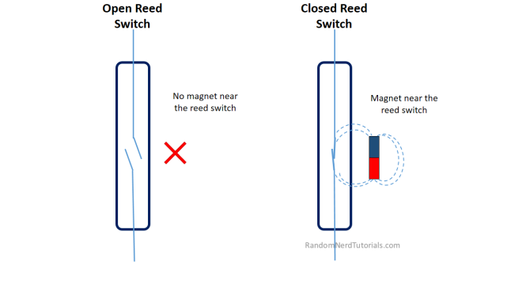

# **Door Sensor**
 This is an IoT based home burglar alarm system.
### Components Used:
1. ESP-32
2. Breadboard
3. Siren/Alarm
4. Magnetic Reed Switch
### Theory:
The reed switch is an electrical switch operated by an applied magnetic field.
The electrical circuit is closed when a magnet is near the switch (less than 13 mm (0.5’’) away). When the magnet is far away from the switch, the circuit is open. See the figure below.

So In order to make this alarm system connect the components as showned in this image below:

After making the connections, just recheck those.And then upload [this](https://github.com/kuldeepaher01/ESP32_Projects/edit/main/DoorSensor_With_Buzzer/doorsensor.ino) arduino sketch.
### Working Video
https://github.com/kuldeepaher01/ESP32_Projects/blob/main/DoorSensor_With_Buzzer/WorkingVideo.mp4
