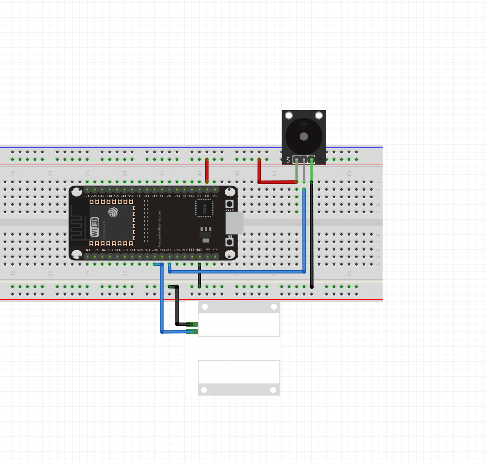

# **Door Sensor**
 This is an IoT based home burglar alarm system.
### Components Used:
1. ESP-32
2. Breadboard
3. Siren/Alarm
4. Magnetic Reed Switch
### Theory:
The reed switch is an electrical switch operated by an applied magnetic field.
The electrical circuit is closed when a magnet is near the switch (less than 13 mm (0.5’’) away). When the magnet is far away from the switch, the circuit is open. See the figure below.

